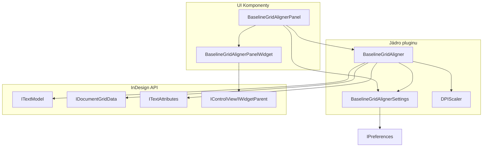

# BaselineGridAligner - Architektura pluginu

Tento dokument popisuje architekturu pluginu BaselineGridAligner pro Adobe InDesign 2024.

## Diagram komponent

## Popis komponent

### UI Komponenty

- **BaselineGridAlignerPanel**: Hlavní třída panelu, která implementuje rozhraní `IPanel` a `IObserver`. Spravuje UI prvky a reaguje na události.
- **BaselineGridAlignerPanelWidget**: Implementuje rozhraní `IPanelControlData` a zajišťuje vytvoření a správu widgetu panelu.

### Jádro pluginu

- **BaselineGridAligner**: Hlavní třída pluginu, která implementuje logiku zarovnání textu k baseline gridu. Podporuje různé typy zarovnání a využívá paralelizaci pomocí OpenMP.
- **BaselineGridAlignerSettings**: Třída pro správu nastavení pluginu. Ukládá a načítá nastavení z preferencí InDesignu.
- **DPIScaler**: Utilita pro dynamické přizpůsobení UI prvků různým rozlišením obrazovky.

## Datový tok

1. Uživatel interaguje s UI panelem (BaselineGridAlignerPanel)
2. Panel aktualizuje nastavení (BaselineGridAlignerSettings)
3. Při aplikaci zarovnání nebo automatickém zarovnání se volá BaselineGridAligner
4. BaselineGridAligner získá data z TextModel a GridData
5. BaselineGridAligner aplikuje zarovnání na TextAttributes
6. Výsledek se zobrazí v dokumentu

## Typy zarovnání

Plugin podporuje čtyři typy zarovnání:

1. **Tracking**: Upraví tracking textu pro zarovnání k baseline gridu
2. **Baseline**: Upraví baseline offset textu
3. **Mezislovní mezery**: Upraví mezery mezi slovy
4. **Kombinované**: Kombinace trackingu a mezislovních mezer

## Optimalizace výkonu

- Paralelizace pomocí OpenMP pro rychlejší zpracování více textových rámců
- Asynchronní zpracování pomocí std::async pro zachování responzivity UI
- Cachování velikosti baseline gridu pro snížení počtu dotazů na API
